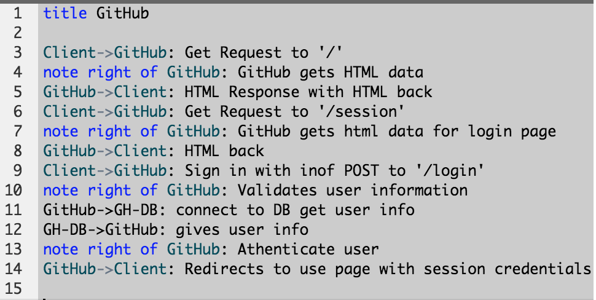
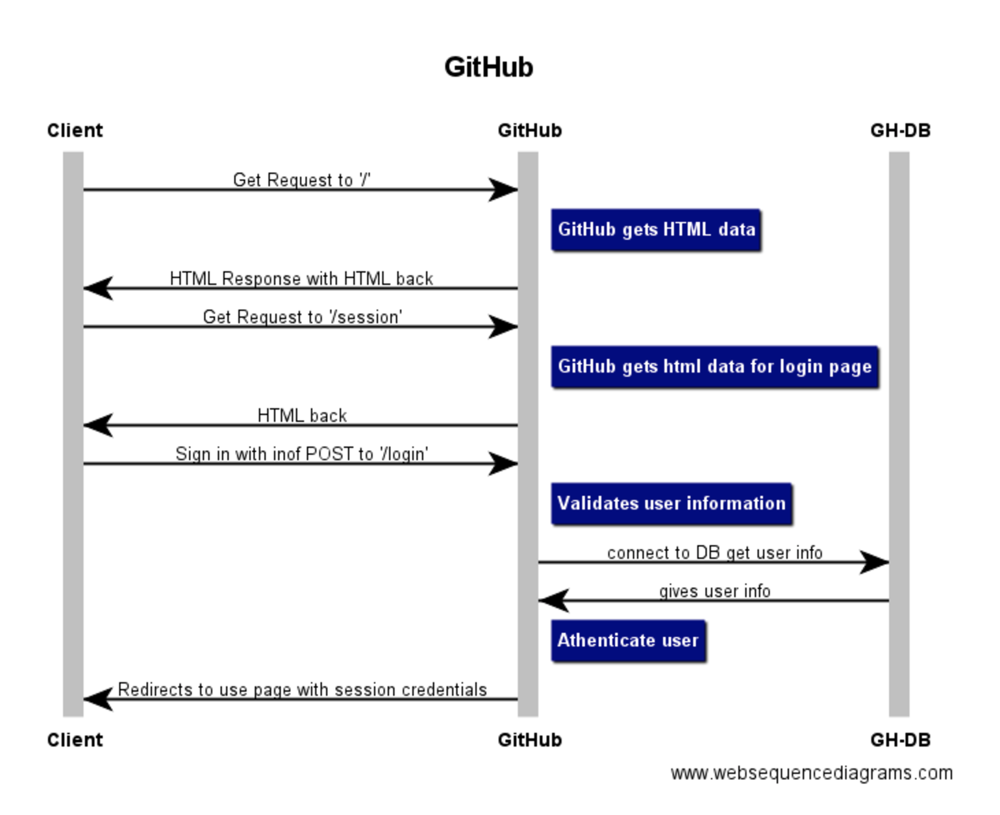

### HTTP Requests

#### Objectives
  - [ ] Describe and diagram HTTP Requestions
  - [ ] Modify and Access HTTP requests in Express
  - [ ] Separate concerns in Express
  - [ ] Valid uers data

  https://www.websequencediagrams.com/

  Make a HTTP requests
    - version
    - type of request
    - header






```js
'https://learn.galvanize.com/cohorts/89/daily_plans/2016-12-12'

app.get('/cohorts/:cohort_id/daily_plans/:date', (req, res) => {
  console.log(req.params.cohort_id);
  console.log(req.params.date);

  })
```
